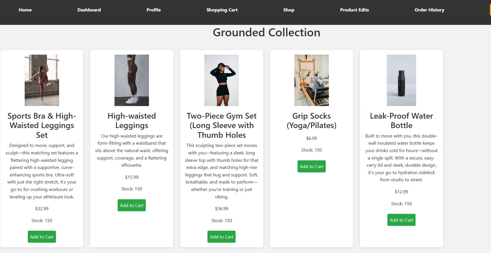
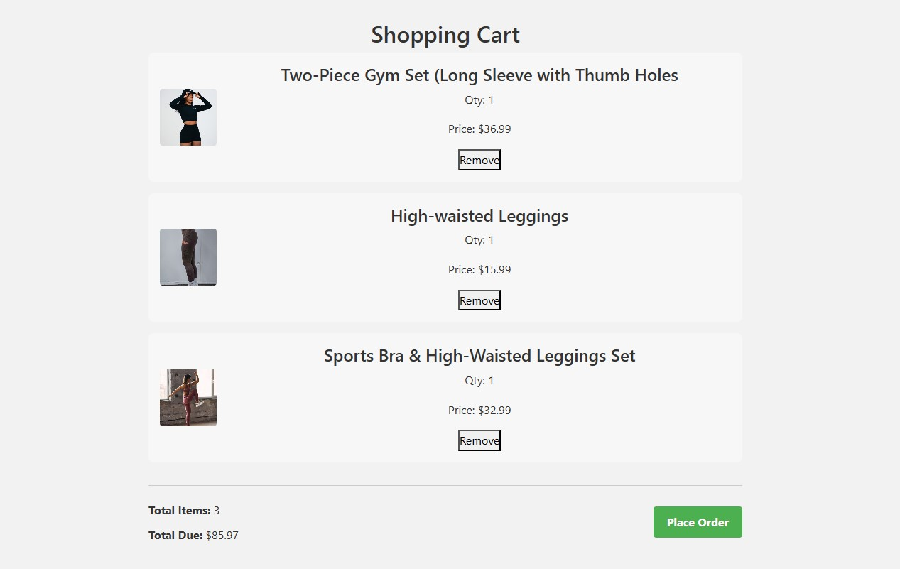
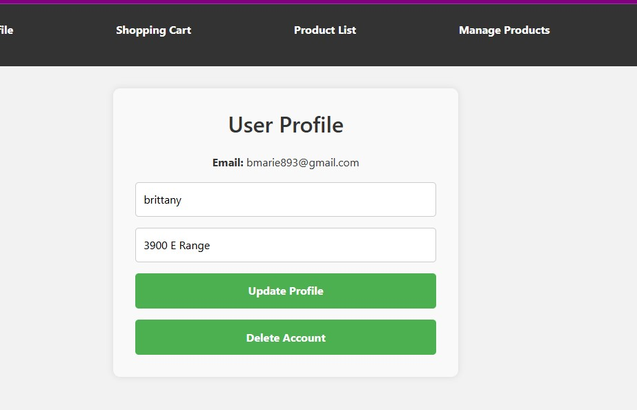
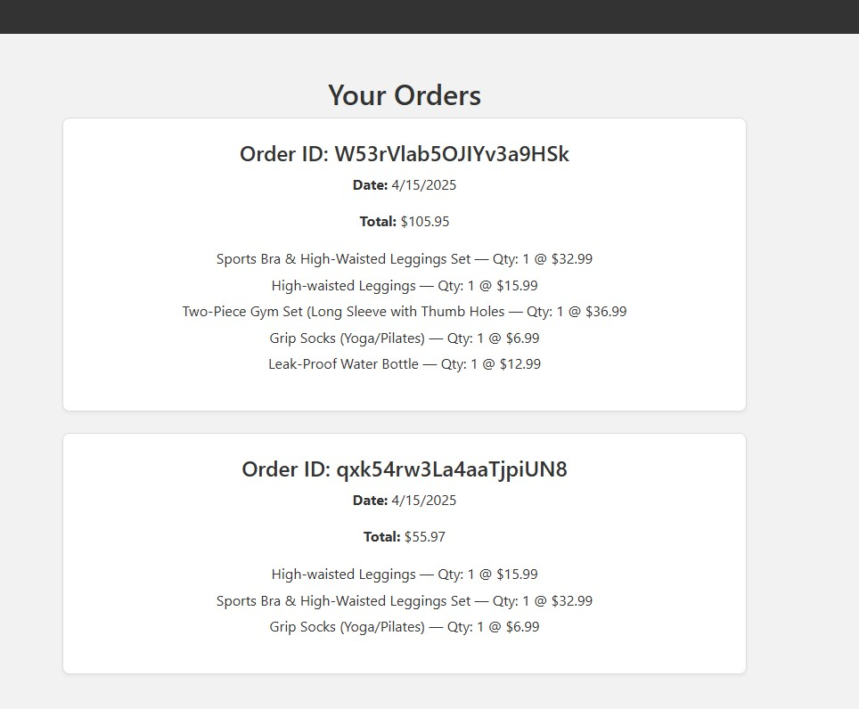
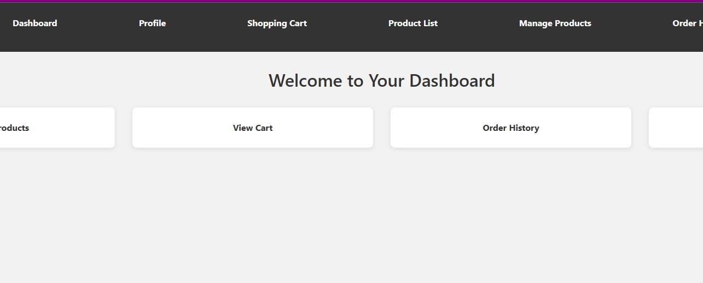
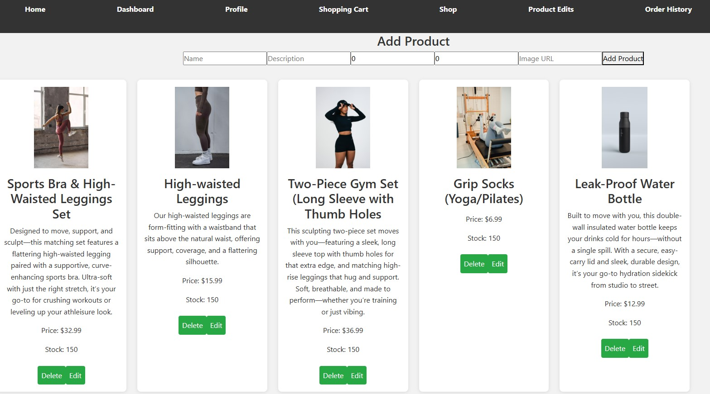

# 🛍️ Firebase eCommerce App

An eCommerce web application built with **React + TypeScript** and powered by **Firebase** for Authentication, Firestore (NoSQL Database), and secure CRUD operations. The app supports product management, user orders, profile pages, admin dashboard functionality, and more.

## 🚀 Features

- 🔥 Firebase Authentication (Register / Sign In)
- 🛒 Add to Cart and Order Checkout
- 🧑 User Profile Management
- 🧾 View Order History 
- 📦 Product CRUD 
- 📊 Dashboard
- 🌐 Responsive UI with React and TypeScript

---

## 📸 Screenshots

### 🏠 Home Page
  
The landing page of the store showcasing featured products and categories.

---

### 📦 Product Listing
  
Browse all products with pricing and quick access to add them to the cart.

---

### 🛒 Shopping Cart
  
View and manage cart items before placing an order.

---

### 🙍‍♂️ User Profile
  
Manage your user profile with data pulled from Firebase Authentication and Firestore.

---

### 📜 Order History
  
Review previously placed orders along with order details.

---

###  Dashboard
  
Overview page for product and order management (admin only).

---

### ✏️ Edit Product
  
Admins can edit or delete existing product entries in Firestore.

---

## 🧰 Tech Stack

- **React + TypeScript**
- **Firebase** (Authentication, Firestore)
- **React Router**
- **Context API / Redux** 
- **Bootstrap**
- **CSS** 

---


## 🔐 Authentication

- Firebase Authentication for Sign Up, Sign In, and Sign Out
- Protected routes for authenticated users
---


## 📦 How to Run Locally

```bash
git clone https://github.com/brittmarie333/mod2knowledgecheck.git
cd firebase-ecommerce
npm install
npm run dev
```


---

## 🙌 Acknowledgements

- [Firebase](https://firebase.google.com/)
- [Firebase help](https://firebase.google.com/docs/auth/web/start)
- [freeCodeCamp](https://www.freecodecamp.org/news/use-firebase-authentication-in-a-react-app/)
- [mdnwebdocs](https://developer.mozilla.org/en-US/docs/Web/CSS)
- [ChatGPT](https://chatgpt.com/)
